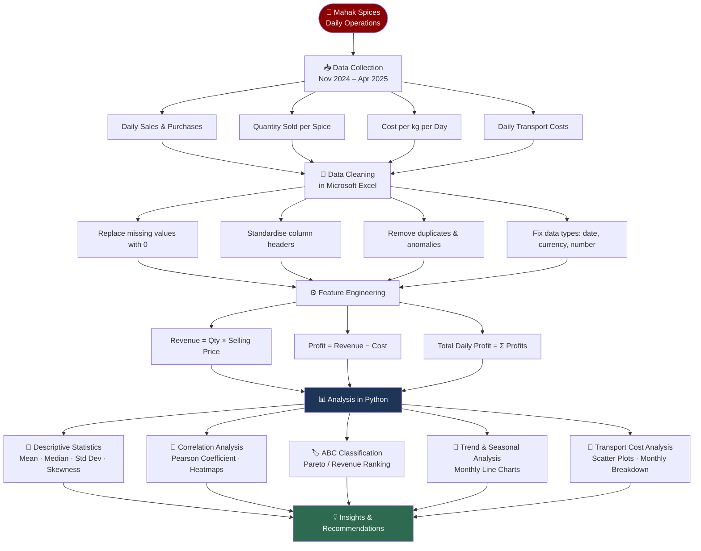
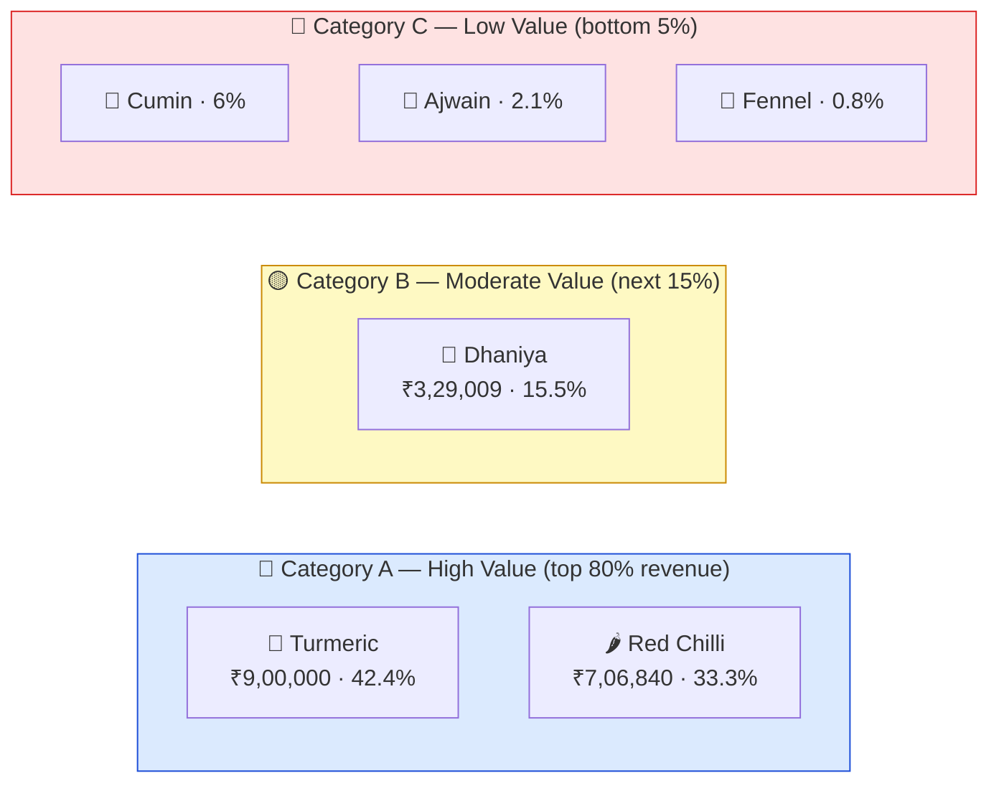
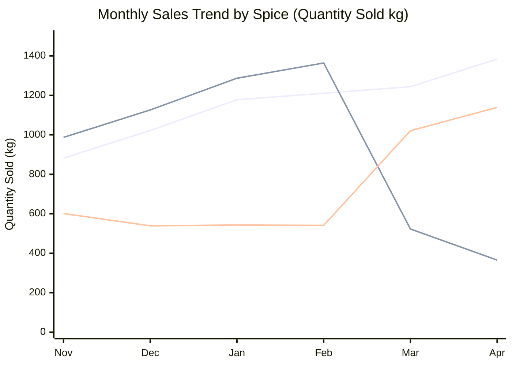
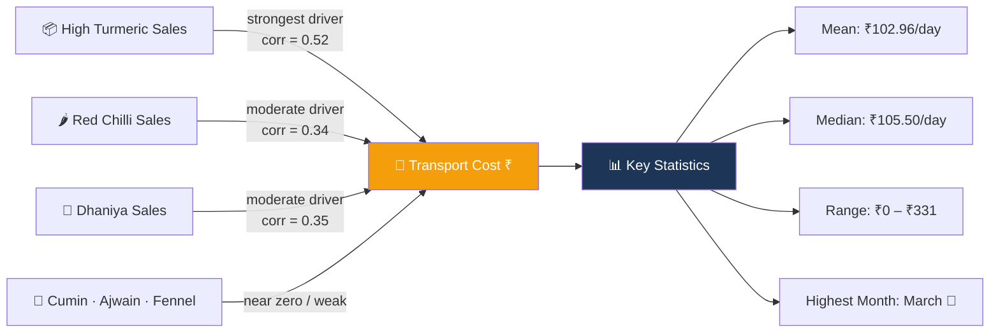

<div align="center">

# 🌶️ Mahak Spices — Operational Efficiency Study

### BDM Capstone Project · Indian Institue of Information Technology Lucknow

[](https://www.python.org/)
[](https://pandas.pydata.org/)
[](https://jupyter.org/)
[](https://www.microsoft.com/excel)

> *A data-driven investigation into inventory, logistics, and spoilage challenges at a B2B spice trading company in Shahjahanpur, Uttar Pradesh.*

---

**Submitted by:** Rohit Raj &nbsp;|&nbsp; **Roll No:** MSE25004 &nbsp;|&nbsp; **Period:** Sept 2025 – Dec 2025

</div>

---
## 📋 Table of Contents

- [Project Overview](#-project-overview)
- [Problem Statements](#-problem-statements)
- [Methodology & Workflow](#-methodology--workflow)
- [Dataset Structure](#-dataset-structure)
- [Key Findings](#-key-findings)
- [ABC Classification](#-abc-classification)
- [Seasonal Trends](#-seasonal-trends)
- [Transport Analysis](#-transport-analysis)
- [Recommendations](#-recommendations)
- [Repository Structure](#-repository-structure)
- [Tools Used](#-tools-used)

---
## 🏢 Project Overview

**Mahak Spices** is a B2B wholesale spice trading business,supplying a wide variety of spices to local retailers and small businesses.

Despite its strong local presence, three key operational challenges limit the company's profitability and long-term scalability:

```
┌─────────────────────────────────────────────────────────────┐
│               THREE CORE OPERATIONAL CHALLENGES             │
├─────────────────┬──────────────────┬────────────────────────┤
│📦 Overdependence │ 🚛 Transport Costs │ ☀️ Summer Spoilage│
│  on few spices   │   fluctuating    │   of Red Chilli       │
└─────────────────┴──────────────────┴────────────────────────┘
```

---
## 🎯 Problem Statements

| # | Problem | Impact |
|---|---------|--------|
| 1 | **Overdependence on Turmeric & Red Chilli** (~76% of revenue) | Revenue risk, idle inventory for slow-movers |
| 2 | **Fluctuating Transportation Costs** (₹0 – ₹331/day, mean ₹103) | Unpredictable margins, no logistics baseline |
| 3 | **Spice Spoilage in Summer (Mar–Apr)** | Sharp Red Chilli sales drop, direct profit loss |

---
## 🔬 Methodology & Workflow



---
## 🗄️ Dataset Structure

The dataset spans **129 business days** (Nov 2024 – Apr 2025) with the following schema:

| Column | Type | Description |
|--------|------|-------------|
| `Date` | datetime | Business day |
| `Turmeric_sold(kg)` | float | Daily quantity sold (kg) |
| `RedChilli_sold(kg)` | float | Daily quantity sold (kg) |
| `Dhaniya_sold(kg)` | float | Daily quantity sold (kg) |
| `CarmonSeeds(Ajwain)_sold(kg)` | float | Daily quantity sold (kg) |
| `Cumin(Jeera)_sold` | float | Daily quantity sold (kg) |
| `Fennel(Sauf)_sold` | float | Daily quantity sold (kg) |
| `*_cost_per_kg` | float | Purchase cost per kg for each spice |
| `*_revenue` | float | Daily revenue per spice (qty × selling price) |
| `Total_Sales` | float | Sum of all spice revenues per day |
| `Total_Purchase` | float | Sum of all purchase costs per day |
| `Total_Profit` | float | Total_Sales − Total_Purchase |
| `Transport` | float | Daily logistics cost (₹) |

---
## 📈 Key Findings

### Revenue Distribution

```
Turmeric     ████████████████████░░░░░░░░░░░░░░  42.4%  (~₹9,00,000)
Red Chilli   ████████████████░░░░░░░░░░░░░░░░░░  33.3%  (~₹7,06,840)
Dhaniya      ███████░░░░░░░░░░░░░░░░░░░░░░░░░░░  15.5%  (~₹3,29,009)
Cumin        ███░░░░░░░░░░░░░░░░░░░░░░░░░░░░░░░   6.0%  (~₹1,27,358)
Ajwain       █░░░░░░░░░░░░░░░░░░░░░░░░░░░░░░░░░   2.1%  (~₹44,575)
Fennel       ░░░░░░░░░░░░░░░░░░░░░░░░░░░░░░░░░░   0.8%  (~₹16,981)
```

> ⚠️ **Turmeric + Red Chilli = 75.7% of total revenue** — a significant concentration risk.

---
## 🏷️ ABC Classification



**Action by category:**
- **Category A** → Prioritise stock, monitor supply chain closely, cold storage for Red Chilli
- **Category B** → Targeted seasonal promotions, increase visibility to push toward Category A
- **Category C** → Reduce stock levels, explore bundling with A/B items, reassess pricing

---
## 📅 Seasonal Trends



| Spice | Trend | Key Insight |
|-------|-------|-------------|
| 🌿 **Turmeric** | 📈 Steady upward growth | Cornerstone product — consistent demand throughout |
| 🌶️ **Red Chilli** | 📈 Peak Feb → 📉 Sharp crash Mar–Apr | Summer spoilage; needs cold storage & reduced summer stocking |
| 🌱 **Dhaniya** | 📉 Dips till Jan → 📈 Strong rise Mar–Apr | Seasonal/festive demand surge — opportunity for promotions |
| 🫙 **Cumin** | Flat with **spike in January** | Likely a bulk/festival order — investigate to replicate |
| 🫙 **Ajwain & Fennel** | Consistently lowest | Reassess inventory levels; candidate for bundling |

---
## 🚛 Transport Analysis



**Transport cost pattern by month:**

| Month | Observation |
|-------|------------|
| Nov | Elevated — high season activity |
| Dec–Jan | Moderate |
| Feb | Rising trend begins |
| **Mar** | **Highest transport cost** — operational inefficiency at peak |
| Apr | Slight decline |

---
## 💡 Recommendations

```mermaid
flowchart TD
    P1[📦 Problem 1\nOverdependence] --> R1A[🎁 Bundle slow spices\nwith Turmeric / Red Chilli]
    P1 --> R1B[📢 Targeted marketing\nfor Dhaniya in Mar–Apr]
    P1 --> R1C[📊 Track emerging demand\nwith monthly trend review]

    P2[🚛 Problem 2\nFluctuating Transport] --> R2A[📝 Long-term vendor\ncontracts with fixed rates]
    P2 --> R2B[🗺️ Route optimisation\nGoogle Maps · Routific]
    P2 --> R2C[📏 Define Transport KPIs\ncost/kg · cost/order]

    P3[☀️ Problem 3\nSummer Spoilage] --> R3A[❄️ Temperature-controlled\nstorage & insulated bags]
    P3 --> R3B[📉 Reduce Red Chilli orders\nin Mar–Apr using forecasting]
    P3 --> R3C[🏷️ Dynamic pricing for\nnear-expiry stock]

    style P1 fill:#1d3557,color:#fff
    style P2 fill:#1d3557,color:#fff
    style P3 fill:#1d3557,color:#fff
    style R1A fill:#2d6a4f,color:#fff
    style R1B fill:#2d6a4f,color:#fff
    style R1C fill:#2d6a4f,color:#fff
    style R2A fill:#2d6a4f,color:#fff
    style R2B fill:#2d6a4f,color:#fff
    style R2C fill:#2d6a4f,color:#fff
    style R3A fill:#2d6a4f,color:#fff
    style R3B fill:#2d6a4f,color:#fff
    style R3C fill:#2d6a4f,color:#fff
```



---


